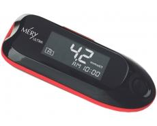
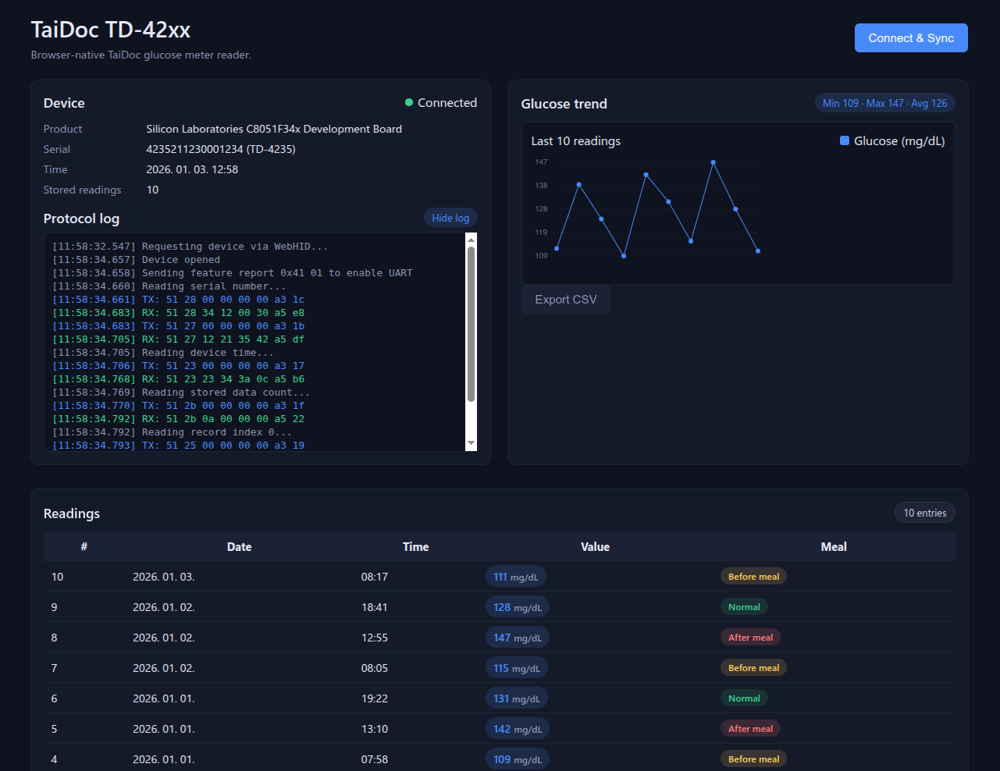

# TaiDoc TD‑42xx / Méry / DiCare WebHID Glucose Reader

A clean, browser‑native glucose meter reader for the **TaiDoc TD‑4235** and its OEM variants (Méry, DiCare, Fora, GlucoSure, and others using the **CP2110 USB HID bridge**).  
No drivers. No installs. No cloud. Everything runs **locally in your browser** using the WebHID API.

This project is designed for people who want a simple, privacy‑respecting way to extract their glucose readings on any platform.

## 📟 Device

## 🖼️ Screenshot

## ⭐ Features

- **WebHID‑based** - works directly in Chromium browsers  
- **No software installation** required  
- **Reads all stored glucose records** from TaiDoc TD‑42xx meters  
- **Supports OEM‑branded devices** (Méry, DiCare, Fora, GlucoSure…)  
- **Live protocol log** with TX/RX color‑coding  
- **Wake‑up frame handling** for reliable communication  
- **Excel‑friendly clipboard export** (TSV)  
- **CSV download** option  
- **Responsive dashboard UI**  
- **Local‑only processing** - no data leaves your machine  

## 🧩 Supported Devices

This tool supports the TaiDoc TD‑4235 and OEM variants using the CP2110 HID‑UART bridge, including:

- **Méry** glucose meters  
- **DiCare / DiCare-Fora** variants  
- **Fora** OEM models  
- **GlucoSure** branded devices  
- Other TD‑42xx family meters with identical protocol  

If your device identifies as a **CP2110 HID‑UART** and speaks the TaiDoc short‑frame protocol, it will likely work.

## 🖥 Browser Compatibility

WebHID is currently supported only in:

- Chrome  
- Microsoft Edge  
- Brave  
- Vivaldi  
- Arc  

Not supported:

- Firefox  
- Safari  
- Mobile browsers  

If WebHID is unavailable, the UI will show a warning and disable the Connect button.

## 🚀 How to Use

1. Open the page in a supported browser  
2. Connect your TaiDoc / Méry / DiCare glucose meter via USB  
3. Click **Connect & Sync**  
4. The device will wake, respond, and send all stored readings  
5. View:
   - Table of readings  
   - Summary (min/max/avg)  
   - Trend chart  
   - Protocol log  
6. Click the **entries pill** to copy all readings to the clipboard (Excel‑friendly TSV)  
7. Or download a CSV file  

## 🛠 Technical Notes

- Implements the **TaiDoc short‑frame protocol**  
- Handles wake‑up frames (`0x54`)  
- Uses CP2110 HID reports (64‑byte packets)  
- Robust frame scanning with byte‑shift resync  
- Color‑coded TX/RX logging for debugging  
- Clean ES‑module architecture  
- All logic runs client‑side  

## 🔒 Privacy

All data stays **on your device**.  
Nothing is uploaded, stored, or transmitted anywhere.

## ⚠️ Disclaimer

This project is community‑maintained and **not affiliated** with TaiDoc, Méry, DiCare, Fora, or any OEM brand.  
Always consult your healthcare provider for medical decisions.

